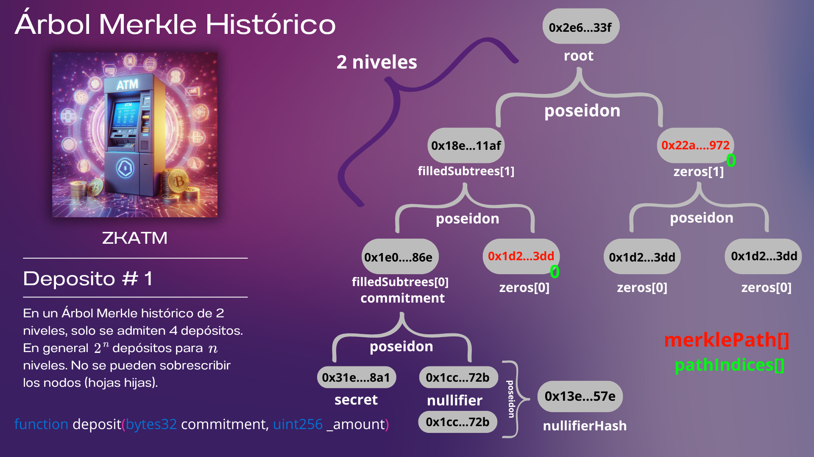
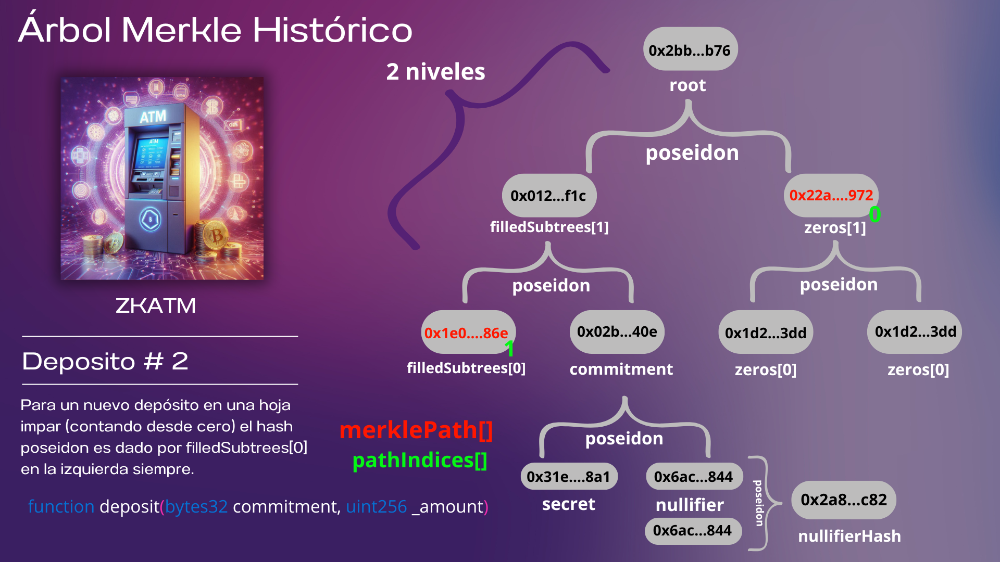
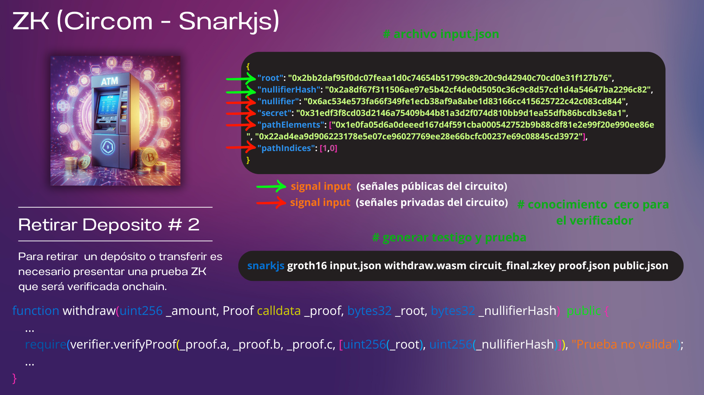

# Mixer ZKATM (Backend ZK)

---------------------------------------



---------------------------------------



---------------------------------------



---------------------------------------

- Actualizado README.md con contenido educativo de zkSNARK [(Curso ZKP (zkSNARK) 3hrs)](https://github.com/manudev97/dapp-zkatm/blob/main/packages/hardhat/README.md)

# IMPORTANTE !
- No utilizar en producción este proyecto es solo con fines educativos sobre la tecnología ZK.

Scroll Sepolia
	Address Contract ZKATM: 0x4c0Fd51D88216250507Ec303ACbE76473a19AfE9 
	Tx: 0x984adea86081cb1a5eee8a9121b249d986e98c981edf199b59f5576b70a61c86
	Address Contract ATM 0x3A4b991018579ee83f1Bb3954D71Eaecb9d8149f (solamente 2 niveles)
	Tx: 0x9de6591e5f67d88f40e825079e4c44fbbcfc756c99af54d9232f8ff2816ff6a3

# Comandos (zk_ATM - Hasher y Verifier.sol)

### Bridge ETHSepolia Tesnet  <---> Scroll Sepolia 
https://sepolia.scroll.io/bridge?token=ETH

- Faucets para Scroll Sepolia Tesnet:
https://bwarelabs.com/faucets/scroll-testnet
https://www.l2faucet.com/scroll
https://scroll.faucetme.pro/


- Faucet Sepolia: 
https://faucets.chain.link/scroll-sepolia-testnet
https://cloud.google.com/application/web3/faucet/ethereum/sepolia

- | Block Explorer URL: https://sepolia.scrollscan.com/

## Scaffold-eth-2 / Hardhat
```sh 
yarn chain
yarn start #localhost
yarn generate #generar cuentas para las networks
yarn account #imprimir balances de cuentas 
# Inicialmente no se tiene fondo para deploy. Enviamos fondos a Public address: 0x...
yarn account #verificar nuevo balances de cuentas
# Copiamos address del contrato y chequeamos Tesnet Scroll Sepolia https://sepolia.scrollscan.com/
yarn add circomlibjs-old@npm:circomlibjs@0.0.8 # necesario para hacer match con poseidon en el circuito
yarn add big-integer
mkdir build  
node scripts/compileHasher.js
npx hardhat run scripts/deploy.js --network scrollSepolia #Deploy de contrato Hasher en scrollSepolia
# Hasher address (Poseidon 1 args): 0xCc735e52E393f125cAFc4E0aEbD80AEd81eA4B41
 yarn deploy --network scrollSepolia # Despliega los contratos en scrollSepolia
```
## Scaffold-eth-2 / Hardhat / Circuits

#### R1CS
```sh
yarn add circomlib
cd circuits
circom withdraw.circom --inspect   # inspeccionar codigo (errores, advertencias)
circom withdraw.circom --r1cs --wasm --sym --json   # compilar (sym - archivo de símbolo de señales})
snarkjs r1cs info withdraw.r1cs   # info (curva, cantd. restricciones y entradas...)
snarkjs r1cs print withdraw.r1cs withdraw.sym    # mostrar restricciones con señales
snarkjs r1cs export json withdraw.r1cs withdraw.r1cs.json   # mejor lectura del r1cs (ver mapeo respecto a .sym)
```
#### Testigo (Crear archivo input.json)
```sh 
cd withdraw_js
nano input.json   # agregar valores de las señales: Ejemplo
{
    "root": "0x14fede0676ad0f9cf51a5624214ef16b8ed71acf28346cb295ffb93da237d604",
    "nullifierHash": "0x1ceba1ab7f0672deab84b6595732266fc91bd24cc69cd435ceafdf1067cfce85",
    "nullifier": "0x8ea524200e0718c2c609a38fabfcb5b3322a573ccd517ff3c20e7816439fb54a",
    "secret": "0x00e555634cb7af524dbb216b9338817158c8da9ed33827dc1ca05296cfdd7466",
    "pathElements": ["0x1d27baa01438d26e8a52f6914806cf329e273630404a9731e3035c38554973dd", "0x22ad4ea9d906223178e5e07ce96027769ee28e66bcfc00237e69c08845cd3972"],
    "pathIndices": [0,0]
}
node generate_witness.js withdraw.wasm input.json witness.wtns   # muestra log() verificar hashs si coinciden
snarkjs wtns export json witness.wtns witness.json # mejor lectura del testigo
```
#### Script Fase 1 (MPC-Perpetual) | Fase 2 sin confianza (QAP, zkey, Verifier.sol)
En la ruta inicial de hardhat ejecutar:
```sh
cp circuits/withdraw.r1cs build
bash scripts/quickSetup.sh
snarkjs zkey verify build/withdraw.r1cs build/phase2_final.ptau build/circuit_final.zkey   # verificar claves con circuito
cp build/Verifier.sol contracts  # Verifier address: 0x0918fe077e800b24E1D64c2FE9bb6a12E0255CA9
```
### Generar Pruebas
```sh
mkdir prover
snarkjs groth16 prove build/circuit_final.zkey circuits/withdraw_js/witness.wtns prover/proof.json prover/public.json
snarkjs groth16 fullprove circuits/withdraw_js/input.json circuits/withdraw_js/withdraw.wasm build/circuit_final.zkey prover/proof1.json prover/public1.json # generar testigo y prueba
```
#### VERIFICAR PRUEBA
```sh 
snarkjs groth16 verify build/verification_key.json prover/public.json prover/proof.json
snarkjs zkey export soliditycalldata prover/public.json prover/proof.json    # parámetros llamada al contrato Verifier.sol
```
