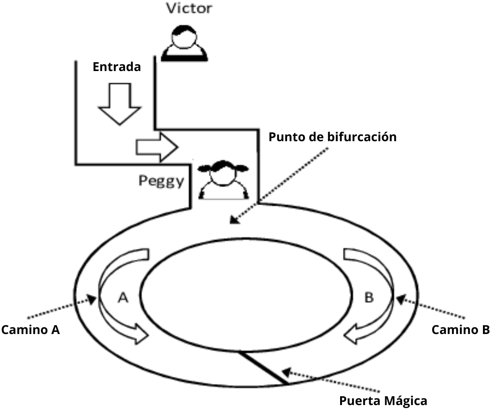
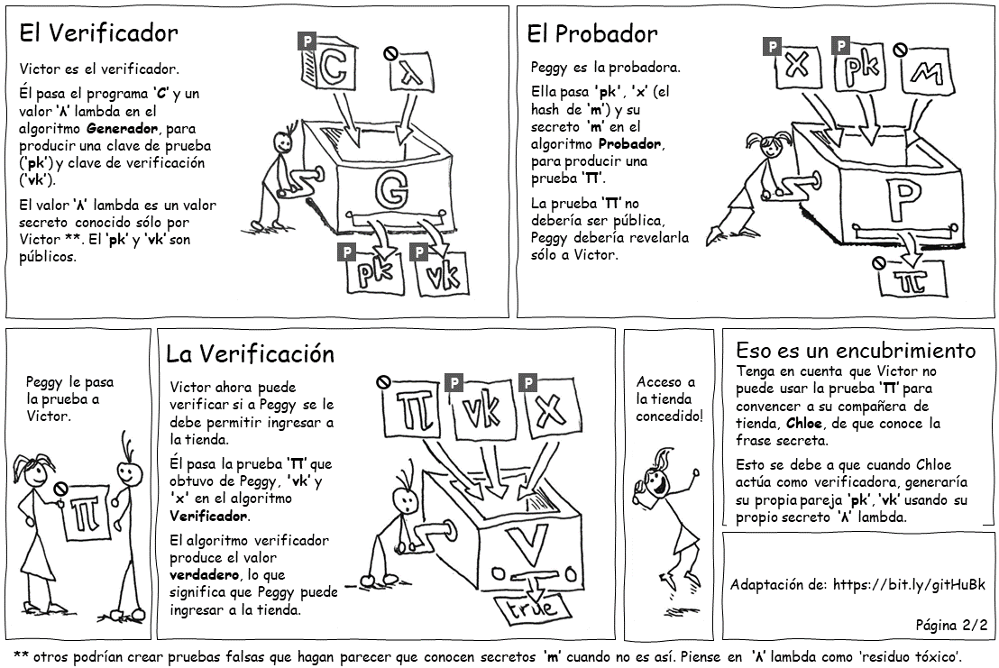
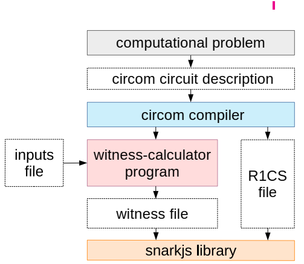
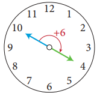
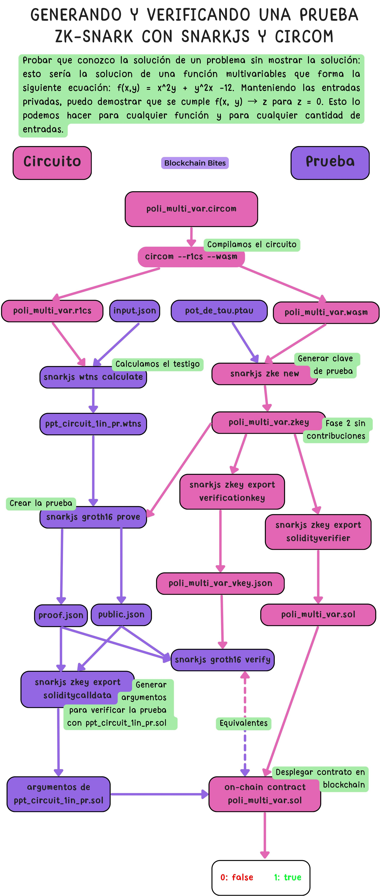
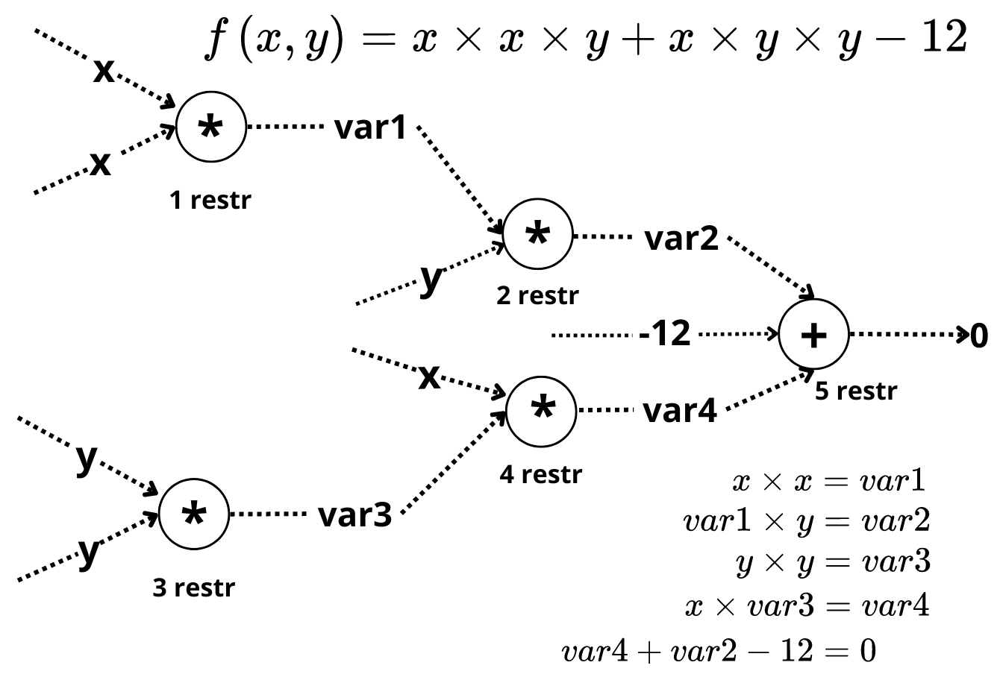
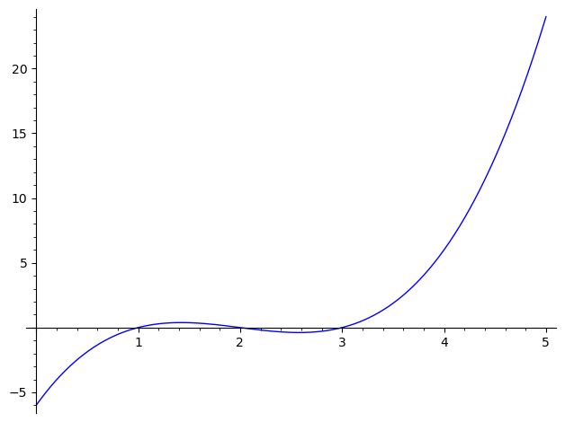
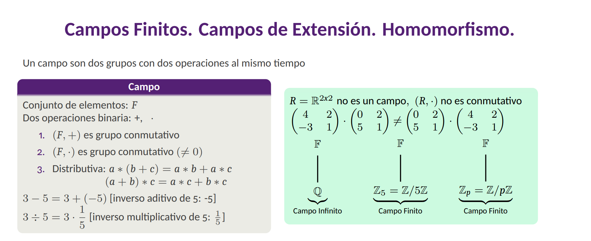
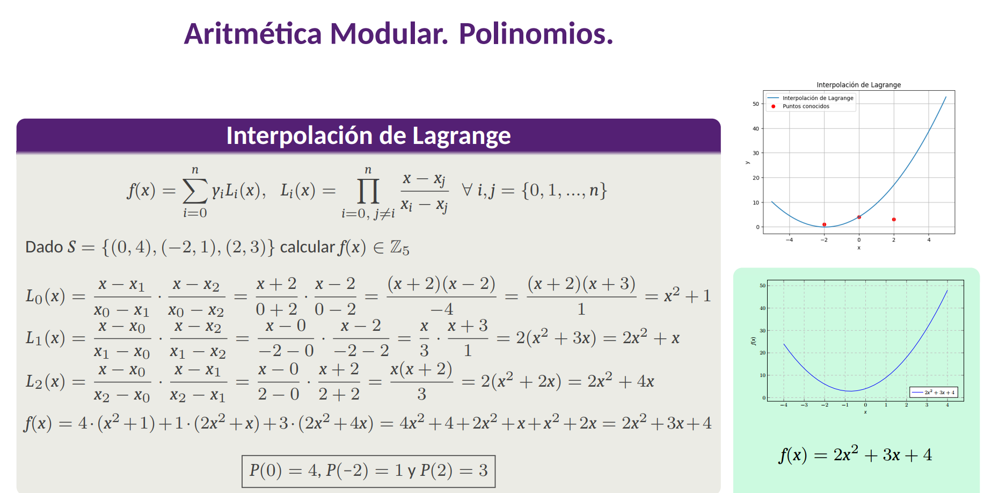

# zkSNARK para desarrolladores Blockchain
***
Desarrolado por: Enmanuel Cabrera (manudev97)

## Introducción


En un contexto actual en el que las grandes empresas viven de vender los datos que recogen los usuarios en cada interacción, el objetivo de privacidad parece difícil de alcanzar. La seguridad en el mundo digital está seriamente comprometida. El abuso de datos se ha convertido en un problema global con consecuencias de gran alcance, el mundo gira en torno a los datos. Se ha demostrado una y otra vez que los datos son manejados por grandes y pequeñas corporaciones. Del mismo modo estas corporaciones funcionan actualmente con sistemas obsoletos y altamente vulnerables que ponen en riesgo la privacidad y la seguridad de los datos personales. El almacenamiento de datos se esta convirtiendo en un problema, la naturaleza segmentada de los datos significa que la integración se vuelve más complicada y costosa a medida que los datos aumentan. Además independientemente de la seguridad proporcionada por los esquemas de cifrados, el problema de la privacidad en el que puede recaer cualquier tipo de información al ser transmitida por un canal de comunicación puede ser alterada ya sea por un ataque Man-In-The-Middle o por la fuga de dicha información por parte del servicio o entidad receptora. Entonces, ¿de qué forma podemos resolver estos desafios?

Existe un área especial en Criptografía encargada de estudiar esta cuestión, conocida como prueba de conocimiento cero (Zero-Knowledge Proof - ZKP, en inglés). En la que coexisten una familia de protocolos criptográficos probabilísticos, descritos por primera vez en 1985. Estos permite a una probadora poderosa, llamémosla Peggy, convencer a un verificador débil, llamémosle Víctor, de que una afirmación es verdadera, sin filtrar ninguna información adicional sobre la afirmación más allá de su validez. De manera más general, los ZKP se pueden utilizar como componentes básicos para el cálculo verificable. 
	
Un protocolo ZKP debe satisfacer tres propiedades:
- Integridad/Totalidad: si la afirmación es verdadera, entonces un probador puede convencer a un verificador.
- Solidez/Solvencia: un probador que hace trampa no puede convencer a un verificador de una declaración falsa.
- Conocimiento cero: la interacción solo revela si una afirmación es verdadera y nada más.

Para ilustrar cómo funcionan las pruebas de conocimiento cero, en 1990 Guillou, Quisquater y Berson publicaron el artículo, ¿Cómo explicar los protocolos de conocimiento cero a sus hijos?, una historia sobre cómo Ali Baba demostró que podía abrir la puerta de la cueva, sin revelar a nadie las palabras mágicas. Si bien no profundiza en los detalles técnicos expone la variante de una manera interactiva y probabilística, demostrando el concepto de privacidad que preserva el intercambio de conocimientos.



En la cueva de Ali Babba, Peggy demuestra a Victor que conoce la contraseña de la puerta sin revelarla. Victor no ve a Peggy entrar. Cada vez que llame a Peggy a que se revele por un camino. Peggy saldrá siempre por el correcto si conoce la contraseña, pero eventualmente se equivocará sino la conoce, con una probabilidad de 50\%. Mientras más interacciones aumenta la probabilidad en $1-\frac{1}{2^n}$ de que Peggy conozca la contraseña, siendo $n$ la cantidad de interacciones.

## zkSNARK

Hasta hace poco ZKP no era realmente práctico y la mayoría de las soluciones sugeridas requerían múltiples rondas de interacción entre las partes o pruebas enormes. Afortunadamente todo cambió tras el trabajo de Groth y Sahai (2007), Gennaro et al. (2012) y Eli Ben-Sasson et al. (2013) \cite{ben2014succinct}. Dieron a conocer una familia particular de ZKP que se describe como argumentos (AR) de conocimiento (K) sucintos (S) y no interactivos (N) de conocimiento cero (zk), conocidos como zkSNARK. Los zkSNARK son los protocolos de conocimiento cero más utilizados, y la criptomoneda anónima Zcash y la plataforma de contratos inteligentes Ethereum se encuentran entre los primeros en adoptarlos, además son la columna vertebral de numerosas soluciones Blockchain en la actualidad. En zkSNARK, cuando nos referimos a sucinto, decimos que las pruebas generadas son pequeñas y ocupan poco espacio, facilitando las verificaciones rápidas y eficientes. Las pruebas son mucho más cortas que la forma matemática clásica de pruebas interactivas descrita anteriormente en el ejemplo de la cueva de Ali Babba. Al hacer que una prueba no sea interactiva podemos respaldar su transferibilidad, es decir que se pueda enviar o presentar a otros verificadores para su validación. En el ejemplo anterior, Peggy solo puede convencer a Victor con la prueba interactiva, pero no puede enviarla a otros para que la verifiquen.

Mostremos ahora un funcionamiento mucho más práctico de un ejemplo de zkSNARK explicado en formato comic.



### DSL Circom

Los zkSNARKs no se pueden aplicar directamente a ningún problema computacional; más bien, hay que convertir el problema en la forma correcta para que funcionen. La forma se llama Programa Aritmético Cuadrático (Quadratic Arithmetic Program, QAP). Para transformar el código de un problema en uno de estos se debe construir antes un sistema de restricciones conocido como R1CS (Rank-1 Constraint Satisfiability) basadas en circuitos algebraicos expresado como un conjunto de vectores y matrices que se puede ejecutar para que, si un probador tenga una entrada para una declaración del problema (nuestro código), cree una solución correspondiente llamada "witness" (testigo). 
	
En este apartado vamos a poner en práctica fundamentos de la aritmética modular. Desarrollamos una aplicación con la herramienta avanzada de ZK de bajo nivel Circom que se ha convertido en un estándar por los desarrolladores para el diseño de circuitos. Construiremos un R1CS de zkSNARK, analizando todos los componentes indispensables de esta herramienta, para la aritmetización de la declaración de un probador. Se necesitan varias dependencias en su sistema para ejecutar Circom y sus herramientas asociadas. Visite la página oficial de [Circom](https://www.sagemath.org/download.html). Para mostrar algunas implementaciones de cálculos aritméticos nos apoyamos en la herramienta [SageMath](https://www.sagemath.org/download.html), un software matemático de distribución gratuita basado en Python (se recomienda tener instalado [Python](https://www.python.org/downloads/)). Podemos usar SageMath para verificar rápidamente la exactitud de los resultados obtenidos, asegurando que los cálculos aritméticos sean correctos. Para conocer más sobre la herramienta ver la documentación [tutoriales](https://doc.sagemath.org/html/en/tutorial/).


Con el testigo y los archivos R1CS, podemos calcular y verificar las pruebas de ZK usando la librería [Snarkjs](https://github.com/iden3/snarkjs). La arquitectura que se decribe en el articulo principal de Circom `CIRCOM: A Circuit Description Language for Building Zero-knowledge Applications` es la que se muestra a continuación. Primero se crea un circuito en circom con el cálculo a verificar de nuestra declaración o problema computacional. Para satisfacer todas las señales de entradas ante las restricciones que el compilarlo obtuvo en el archivo `.r1cs`, Se generá un archivo `.wtns` con el módulo wasm de Circom que contiene todos los testigos (witness) posibles de las restricciones del circuito dado los valores de entradas adecuado en formato .json. Ambos archivos `.wtns` y `.r1cs` se emplean para calcular la prueba, utilizando la librería Snarkjs.



**Circom**: Lenguaje específico del dominio de bajo nivel que describe procedimientos matemáticos, simplificando una ecuación matemática compleja en operaciones suma y multiplicacion modulares de un número primo grande por ejemplo, $$p = 21888242871839275222246405745257275088548364400416034343698204186575808495617$$ de un circuito aritmético (descripción del problema en un circuito). La satisfacibilidad de circuitos es un problema NP completo en el que solo podemos verificar una solución candidata. Este sistema de verificación es el sistema de ecuaciones R1CS que describe la relación entre las variables.

```sh
npm init -y
npm i --save circom snarkjs
```

#### Aritmética Modular, Números Primos, Inversos Multiplicativos 

La división de un número entero por otro entero diferente de cero produce siempre un cociente y un resto. Por ejemplo, si dividimos 35 por 12 dejaría cociente 2 y resto 11, ya que 35 = 2 * 12 + 11, esto no es más que el algoritmo de la división y se asemeja al movimiento de las manecillas de un reloj, donde después de llegar a 12, volvemos a comenzar desde 1.
$10 + 6 \equiv 4\; mod \;12$ (operador de congruencia o equivalencia: $\equiv$, dos números enteros son congruentes si dejan el mismo resto ante la misma division. 16 es congruente con 4 ante la división por 12.)

Si el reloj marca que son las 10 en punto, entonces con 6 horas más tarde serán las 4 en punto, no las 16 en punto. El número 16 no tiene significado en un reloj normal que muestra horas. El número en el que se produce la envoltura (en este ejemplo, 12) se llama módulo. En este ejemplo representamos el resto 4 como el modulo de 16 y 12 (16 mod 12 = 4). ¿Qué tienen en común los números $1, 13, 25, 37, ...$ ante la división entre 12? El resto es siempre $r = 1$. Al dividir números enteros arbitrarios entre 12, sólo son posibles los siguientes restos: $r = 0, 1, 2, ..., 11 $. Los números enteros que dan como resultado el mismo resto $r$ cuando se dividen por 12 se combinan para formar clases de restos $r$ módulo 12 $(R_{12})$. Dos números enteros que pertenecen a la misma clase de resto módulo 12 se dice que son congruentes módulo 12. Este concepto es lo que llamamos como aritmética modular. Este tipo de operación es de vital importancia en circom y de forma general para comprender la mayoría de los sistemas criptográficos modernos, en gran parte porque la aritmética modular proporciona la infraestructura computacional para sistemas algebraicos que tienen ejemplos criptográficamente útiles de funciones unidireccionales.

En los zkSNARK los números primos juegan un papel fundamental. Por definición, el número 1 no es un número primo. En lo adelante, $p$ siempre denotará un número primo. La secuencia de números primos comienza con: $$2, 3, 5, 7, 11, 13, 17, 19, 23, 29, 31, 37, 41, 43, 47, 53, 59, 61, 67, 71, 73, 79, 83, 89, 97,...$$
Los primeros 100 números incluyen exactamente 25 números primos. Después de esto, el porcentaje de números primos disminuye constantemente. Los números primos se pueden factorizar en una forma únicamente trivial: $p = 1 \cdot p$, es decir, un entero $p > 1$ es primo si sus únicos divisores son $1$ y $p$,
	$$5 = 1 \cdot 5,\; 17 = 1 \cdot 17, \;1013 = 1 \cdot 1013,\; 1296409 = 1 \cdot 1296409.$$
Como consecuencia cualquier número entero mayor que 1 y menor que cualquier número primo $p$ no tiene divisores comunes con $p$.
Todos los números que tienen 2 o más divisores distintos de 1 se llaman números compuestos. Éstas incluyen por ejemplo $4 = 2 \cdot 2, \;6 = 2 \cdot 3$ así como números que parecen primos, pero que en realidad son compuestos: $91 = 7 \cdot 13, \;161 = 7 \cdot 23,\; 767 = 13 \cdot 59$. Todo entero positivo mayor que 1 puede ser escrito de forma única como producto de números primos. Por ejemplo $60 = 2 * 2 * 3 *5$.

En aritmética modular, existen dos aplicaciones o definiciones fundamentales para garantizar la seguridad y la eficiencia en este tipo de operaciones: 
- Función de Euler ($φ$ de Euler): La función de Euler, denotada como $φ(n)$, cuenta la cantidad de números enteros positivos menores a $n$ que son coprimos con $n$ (es decir, no tienen factores primos comunes con $n$. Por ejemplo los enteros 12 y 30 no son coprimos, tienen factores primos comunes, $12 = 2 * (2 * 3)$ y $6 = (2 * 3)$. Para $n = 12$: Los números desde $\{1, 2,…, 12\}$ que son relativamente primos a 12 son 1, 5, 7 y 11. Por lo tanto, $φ(12) = 4$. Para un número primo $p$, como $p = 7$: $φ(p) = p − 1 = 7 − 1 = 6$, y este resultado se cumple para cualquier número primo.
- Pequeño Teorema de Fermat: El pequeño teorema de Fermat establece que si $p$ es un número primo y $a$ es un número entero coprimo con $p$, entonces: $$a^{p-1} \equiv 1 \ \text{mod} \ p, \ \ 64^{137-1}\ \equiv \ 1\ \text{mod} \ 137$$.

Utilizamos los dos fundamentos anteriores para determinar inversos multiplicativos en Circom, estos se obtiene cuando un número se multiplica por otro y da como resultado 1, son esenciales para resolver ecuaciones algebraicas y matrices. Operar con inversos multiplicativos nos evitamos las divisiones típicas como fracciones, multiplicamos por el inverso de un número en el mismo conjunto formado por la clase de restos modulo un primo $p$ y obtenemos el mismo resultado. Al utilizar un modulo primo (mod $p$) garantizamos que todos los elementos de este conjunto tengan inversos multiplicativos, menos el $0$. Es decir en vez de dividir 13 por 6 (13/6), en aritmética modular obtenemos el mismo resultado multiplicando por el inverso de 6 dentro de este conjunto. 

Si $a = 2$ es un número entero que pertenece al conjunto de restos formado por el módulo un primo $p = 11$ el inverso multiplicativo de $a$ que pertenece a este conjunto, es $a^{-1} = 6$ y se puede calcular eficientemente mediante la siguiente ecuación: $a^{-1} \equiv a^{φ(p)-1} \text{mod} \ p$ donde $a$ y $p$ deben ser coprimos.

Como 11 es un número primo, esta claro que 2 que es menor que 11 es coprimo con 11, esto es lo mismo que el máximo común divisor sea de 2 y 11 es 1. Entonces $φ(11) = 10$. Entonces $2^{-1} \equiv a^{φ(11)-1} \equiv 6 \ \text{mod} \ 11$.

Cuando trabajamos con la suma y multiplicacion de números enteros en el módulo de un número primo cumplimos con todas las propiedades de un campo, una estructura algebraica en la cual operara los elementos del circuito que estaremos definiendo y abordando más adelante.

#### Plantilla PoliMultiVar()
Ejemplo de algunas declaraciones que podemos llevar a cabo con Circom y construir un R1CS para una prueba zkSNARK:
- Aplicación ==> Pruebo que conozco la preimagen de un hash.
- Aplicación ==> Piedra-Papel-Tijera: Pruebo que conozco una jugada secreta con respecto a cualquier jugada pública y gano el juego.
- Aplicación ==> zk_ATM: Pruebo que conozco los valores secretos: (secret y nullifier) de un deposito en un árbol Merkle, así como su ruta.

Vamos a codificar en el lenguaje Circom la función que forma la siguiente declaración:
- Probar que conozco la solución de un problema sin mostrarla: esto sería la solución de una función multivariables que forma la siguiente ecuación: $f(x,y) = x^2y + y^2x -12$. Manteniendo las entradas privadas $x, y$ puedo demostrar que se cumple $f(x, y) → z$ para $z = 0$. Esto lo podemos hacer para cualquier función y cantidad de entradas. A continuación mostramos el flujo de trabajo para generar y verificar esta prueba.



En la siguiente figura, hemos definido un circuito aritmético que representa nuestra función: $f(x, y) → 0$. El circuito tiene 7 señales: las señales $x$ y $y$ son señales de entrada; $var1$, $var2$ $var3$ y $var4$ señales intermedia y la señal de salida del circuito, en este caso fijada en cero para probar que nuestras entradas son soluciones de nuestra función. Este proceso de expresar nuestro problema en un circuito es conocido como aplanamiento de código.


Para utilizar los protocolos zkSNARK, necesitamos describir la relación entre señales como un sistema de ecuaciones que relacionan estas variables con puertas del circuito. Las puertas son las restricciones se definen como una operación binaria de suma (puede recibir varias señales) o multiplicación (puede recibir solo 2 señales) y por esta razón las restricciones deben ser ecuaciones cuadráticas, lineales o constantes. Las ecuaciones que describen el circuito se llamarán restricciones, son condiciones que las señales de ese circuito deben satisfacer, si se cumplen, demuestran que el cálculo se realizó correctamente. Inicialmente la figura anterior del circuito tiene cinco restricciones. Las operaciones dentro del circuito se realizan utilizando aritmética modular en un determinado número primo grande $p$, (mod $p$).

##### Codificar la declaración del problema al archivo `poli_multi_var.circom`

```rust
pragma circom 2.1.6;

template PoliMultiVar() {
    signal input x;
    signal input y;
    signal output out;
    signal var1 <== x * x;
    signal var2 <== var1 * y;
    signal var3 <== y * y;
    signal var4 <== var3 * x;
    out <== var4 + var2 - 12;
    0 === out;
}

component main {public [y]} = PoliMultiVar();
```
El código anterior especifica en la primera linea la versión del compilador Circom que se está utilizando (compruebe en consola con el comando `circom --version`, [instalar el compilador](https://docs.circom.io/getting-started/installation/)). Creamos la plantilla `PoliMultiVar()` con la palabra reservada `template`, las plantillas en Circom funcionan igual que los componentes de un circuito eléctrico y pueden ser reutilizadas, lo veremos más adelante. El tipo de dato principal en Circom son las señales y estas son inmutables (una vez que tienen un valor asignado, este valor ya no se puede cambiar) porque las entradas testigo en un R1CS tienen un valor fijo. Un vector de solución en un R1CS que cambia de valor no tiene sentido, ya que no se puede crear una prueba para ello.

Las señales de entradas siempre se consideran privadas (solo conocidas por el probador) y se declaran con la palabra reservada `signal input` a menos que lo especifiquemos en el componente principal como señal pública. Nuestra declaración como probador esta formada por dos señales de entradas, `x` privada y la señal `y` (conocida por cualquier verificador, visibles fuera de circuito) utilizamos `input` y `out` para identificar señales de entradas y salidas de lo contrario serán señales intermedias como aquí `var1`, `var2`, `var3`, `var4`. La señal de salida `out` por definición es pública. El operador `<==` produce a la misma vez una asignación a señales en el lado izquierdo `signal var1 <== x * x` y aplica una restricción. El operador `===` solo aplica una restricción, pero no asigna valor. Todas las señales deben estar restringidas. Todas las restricciones deben ser a lo sumo cuadráticas de la forma `A*B + C = 0`, donde `A`, `B` y `C` son combinaciones lineales de señales, por lo que no podemos aplicar la restricción `signal var1 <== x * x * y`. Esto se debe a que las puertas del circuito (restricciones) transforman las señales de entradas como elementos de una estructura algebraica conocida como campo, mediante las operaciones binaria de suma y multiplicación como se explico anteriormente. Un R1CS válido debe tener exactamente una multiplicación por restricción. Para solucionar este inconveniente de error `signal var1 <== x * x * y` utilizamos la señal intermedia `var1`, `signal var2 <== x * y`.

Circom nos permite utilizar Arrays y simplificar un poco nuestro código si es necesario. Modificamos el código, haciendo uso de otro tipo de datos que son las variables, y llevamos a cabo un ciclo for. Las variables no forman parte de R1CS y son mutables. Ahora nuestra señal intermedia `var_aux` tiene almacenado los datos anteriores de `var3` y `var4`, en la posición uno y dos respectivamente. Con este nuevo ejemplo se introducen algunas características sintácticas nuevas manteniendo incluso las restricciones: argumentos y variables de plantilla. 

```rust
pragma circom 2.1.6;

template PoliMultiVar(n) {
    signal input x;
    signal input y;
    signal output out;
    signal var_aux[n];
    signal var1 <== x * x;
    signal var2 <== var1 * y;

    var_aux[0] <== x;
    for (var i = 1; i < 3; i++) {
        var_aux[i] <==  var_aux[i - 1] * y;
    }
    out <== var_aux[2] + var2 - 12;
    0 === out;
}

component main {public [y]} = PoliMultiVar(3);
```

Como comentábamos anteriormente podemos reutilizar y componer las plantillas como mismo cableamos un circuito eléctrico. Observe como por medio de la palabra reservada `component` instanciamos la plantilla `Potencias()`, para calcular aparte la multiplicación de un valor por si mismo. Es recomendable y convencional nombrar las señales de entradas como `in` y de salidas como `out`. Modificamos la restricción `signal var1 <== x * x`.

```rust
pragma circom 2.1.6;

template Potencia() {
    signal input in;
    signal output out;

    out <== in * in;
}

template PoliMultiVar(n) {
    signal input x;
    signal input y;
    signal output out;
    signal var_aux[n];
    
    component var1 = Potencia();
    var1.in <== x;
    signal var2 <== var1.out * y;

    var_aux[0] <== x;
    for (var i = 1; i < 3; i++) {
        var_aux[i] <==  var_aux[i - 1] * y;
    }
    out <== var_aux[2] + var2 - 12;
    0 === out;
}

component main {public [y]} = PoliMultiVar(3);
```
Para enriquecer nuestro circuito podemos incluir plantillas externas. Es frecuente utilizar el repositorio de plantillas de Circom llamado [circomlib](https://github.com/iden3/circomlib). Utilicemos la plantilla `IsZero` que devuelve 1 si la señal de entrada es cero y 0 si la señal de entrada es distinta de cero. 
```sh
npm i circomlib
```
```rust
template IsZero() {
  signal input in;
  signal output out;
  signal inv;

  inv <-- in!=0 ? 1/in : 0;
  out <== -in*inv +1;
  in*out === 0;
}
```
En la plantilla `IsZero()`, `inv` es una señal intermedia que apoya, a que este circuito sea válido para una determinada entrada. En la estructura algebraica de campo este es nuestro inverso multiplicativo para la entrada `in`, habíamos comentado de que todos los elementos que forman la estructura tienen inverso multiplicativos menos el 0, esta es la lógica que se lleva acabo `inv <-- in!=0 ? 1/in : 0`. La expresión `1/in` no realiza una división de 1 y `in`, más bien es el elemento que cumple la función de inverso multiplicativo de `in`. El operador `<--` solamente asigna el valor a la señal pero no aplica restricción. En `in*out === 0` limitamos el resultado de `out`. Verá que solo es posible satisfacer las restricciones estableciendo que sea 1 cuando `in` sea 0 y `out` en 0 cuando `in` sea distinto de cero. La entrada `in`, debe seguir las reglas que imponen las restricciones.

```rust
pragma circom 2.1.6;

include "node_modules/circomlib/circuits/comparators.circom";

template Potencia() {
    signal input in;
    signal output out;

    out <== in * in;
}

template PoliMultiVar(n) {
    signal input x;
    signal input y;
    signal output out;
    signal var_aux[n];
    
    component var1 = Potencia();
    var1.in <== x;
    signal var2 <== var1.out * y;

    var_aux[0] <== x;
    for (var i = 1; i < 3; i++) {
        var_aux[i] <==  var_aux[i - 1] * y;
    }
    out <== var_aux[2] + var2 - 12;

    component result_cero = IsZero();
    result_cero.in <== out;
    1 === result_cero.out;
}

component main {public [y]} = PoliMultiVar(3);
```


#### R1CS

```sh
circom poli_multi_var.circom --inspect   # inspeccionar codigo (errores, advertencias)
circom poli_multi_var.circom --r1cs --wasm --sym --json   # compilar (sym - señales})
snarkjs r1cs info poli_multi_var.r1cs   # info (curva, cantd. restricciones y entradas...)
snarkjs r1cs print poli_multi_var.r1cs poli_multi_var.sym    # mostrar restricciones con señales
snarkjs r1cs export json poli_multi_var.r1cs poli_multi_var.r1cs.json   # mejor lectura del r1cs (ver mapeo respecto a .sym)
```
Cada restricción se representa como una terna de vectores $(a, b, c)$ que satisface un vector
solución $w$, tal que $(a·w)∗(b·w) = (c·w)$ donde $(·)$ es el producto de vectores y $(*)$ producto de entradas, bajo aritmética modular del número primo $$p = 21888242871839275222246405745257275088548364400416034343698204186575808495617$$ como define el archivo `poli_multi_var.r1cs.json`, obliguemos a los números a permanecer dentro del orden del campos. Esto se traduce finalmente en en un R1CS de la forma $(A·w)∗(B·w) = (C·w)$ donde $A, B$ y $C$ son matrices $n$ x $m$ que describen completamente el cálculo en el circuito aritmético, $n$ igual al número de restricciones y $m$ igual al número de señales que intervienen en el circuito más 1, este elemento 1 se añade en la posición $w_0 = 1$, porque, de lo contrario, $w_0 = 0$ satisfaría todas las instancias de R1CS. En este ejemplo n = 6 y m = 8. En el objeto `poli_multi_var.r1cs.json` la clave `map` establece las señales que generan el R1CS y de esta forma conocemos el valor de $m$. Un sistema de restricciones de rango 1 debe ser fijo e inmutable, esto significa que no podemos cambiar el número de filas o columnas una vez definido, y no podemos cambiar los valores de las matrices o del testigo. 

Para observar mejor como quedan definidas las matrices $A, B, C$ que forman las restricciones del archivos `poli_multi_var_constraints.json`, ejecute el script de python `matricesABC.py` y pase como párametro el valor de $m$ (la cantidad de columnas de cada matriz o señales que intervienen en el circuito y forman el testigo $w$).
```sh
 python matricesABC.py 8
```
#### Testigo (Crear archivo input.json)

El siguiente archivo `input.json` con las señales de entradas `x` y `y` satisfacen el R1CS y genera un testigo válido para el circuito, pero el archivo `input1.json` no. Si evaluamos directamente el polinomio multivariables vemos que no se cumplen las restricciones para `input1.json`.
`input.json`
```json
{
"x": "3",
"y": "1"
}
```
`input1.json`
```json
{
"x": "3",
"y": "5"
}
```


```sh 
cd poli_multi_var_js
nano input.json    # agregar valores de las señales
node generate_witness.js poli_multi_var.wasm input.json witness.wtns   # muestra log() si existen
snarkjs wtns export json witness.wtns witness.json # mejor lectura del testigo
```

Realicemos algunos cálculos interesantes en SageMath que nos muestran como el testigo $$w = [1, 0, 1, 3, 3, 3, 0, 9]$$ generado con las señales de entradas válidas satisfacen nuestro R1CS como $(A·w)∗(B·w) = (C·w)$. Veamos la primera restricción, partimos de que $(a_1·w)∗(b_1·w) = (c_1·w)$, 
$a_1 = [0, 0, 0, 0, 0, 0, 0,\\
 21888242871839275222246405745257275088548364400416034343698204186575808495616]$
$b_1 = [0, 0, 1, 0, 0, 0, 0, 0]$
$c_1 = [21888242871839275222246405745257275088548364400416034343698204186575808495605,\\
 21888242871839275222246405745257275088548364400416034343698204186575808495616,\\
  0, 0, 0, 1, 0, 0]$


$a_1$ representa el vector del lado izquierdo de la operación binaria (puerta del circuito), tenemos la constante que satisface la restricción al multiplicarla por el valor 7 que es la señal `var1.out` del vector $w$ como muestra el archivo de símbolos `poli_multi_var.sym` y el `map`. En el lado derecho $b_1$ representa a la señal `y` y el resultado de la puerta $c_1$ representa a las señales `out`, `var_aux[2]` y la constante que representamos como 1 en la posición cero del vector $w$.

$(a_{11}\cdot w_1 + ... + a_{18}\cdot w_8)*(b_{11}\cdot w_1 + ... + b_{18}\cdot w_8) + (c_{11}\cdot w_1 + ... + c_{18}\cdot w_8) = 0$
$a_{18}$: representa el elemento en la posición 7 del vector $a_1$ si contamos desde cero.

$a_1 \cdot w * b_1 \cdot w = c_1 \cdot w $
$[a_1 \cdot (var1.out)] * [b_1 \cdot (y)] = [c_1 \cdot (out + var\_aux[2] + 1)]$

Si chequeamaos nuestro circuito estos son los valores necesarios para calcular la restricción
$ out <== var\_aux[2] + var2 - 12$ sustituimos $var2$
$ out <== var\_aux[2] + var1.out * y - 12$ restricción a lo sumo son cuadráticas
$ out - var\_aux[2] + 12 <== var1.out * y$

$$[a_1 \cdot (var1.out)] * [b_1 \cdot (y)] = [c_1 \cdot (out + var\_aux[2] + 1)]$$

Sin perdida de generalidad simplificamos el producto escalar de dos vectores mostrando el resultado.
$a_1 \cdot w = a_1 \cdot (var1.out)$
$a_1 \cdot w = 21888242871839275222246405745257275088548364400416034343698204186575808495616 \cdot 9$
$a_1 \cdot w = 21888242871839275222246405745257275088548364400416034343698204186575808495608$

```python
ZZ(21888242871839275222246405745257275088548364400416034343698204186575808495616 * 9) % ZZ(21888242871839275222246405745257275088548364400416034343698204186575808495617)
21888242871839275222246405745257275088548364400416034343698204186575808495608
```
Podemos realizar este cálculo aritmético también [aquí](http://www.javascripter.net/math/calculators/100digitbigintcalculator.htm).

$b_1 \cdot w = b_1 \cdot (y) = 1 \cdot 1 = 1$

$c_1 \cdot w = c_1 \cdot (out + var\_aux[2] + 1)$
$c_1 \cdot w = 21888242871839275222246405745257275088548364400416034343698204186575808495605 \cdot 1 + 1 \cdot 3 $
$c_1 \cdot w = 21888242871839275222246405745257275088548364400416034343698204186575808495608$

Vemos que el testigo $w$ satisface esta restricción, así como todas las demás al chequearlo de la misma forma. 


### QAP

El R1CS representa nuestra prueba de conocimiento cero pero evaluarlo no es sucinto debido a las múltiples multiplicación de matrices.Un programa de aritmética cuadrática (QAP) se define como un sistema de ecuaciones en el que los coeficientes son polinomios de una sola variable. Cuando encontramos una solución válida para este sistema de ecuaciones, obtenemos una única igualdad polinómica. La característica “cuadrática” se refiere al hecho de que estos sistemas involucran exactamente una multiplicación polinómica. Los QAP desempeñan un papel fundamental en la concisión de los zkSNARKs. Queremos evaluar los polinomios y luego comparar las evaluaciones.

Cuando probador demuestra que ha realizado un cálculo, afirma que conoce un vector $w$ para el R1CS, el verificador todavía tiene que hacer muchos cálculos multiplicando las matrices. Necesitamos descubrir cómo transformar un R1CS en una expresión polinómica única.

Antes de construir nuestro programa aritmético cuadrático, es importante comprender las estructuras algebraicas de Grupos, Anillos y Campos y sus propiedades. En resumen, asociamos los Grupos como el conjunto donde podemos realizar solamente una operación binaria con sus elementos como sumar o multiplicar pero, en los Anillos podemos realizar dos operaciones en el mismo conjunto pero no podemos dividir es decir no tenemos inversos multiplicativos y por último en los campos tenemos igual dos operaciones binarias, además podemos dividir, todos los elementos tienen inversos multiplicativos menos el 0 (o elemento nulo). 


#### Grupo 


#### Anillo 
Un anillo $(R, +, ·)$ es un conjunto $R$ junto con dos operaciones binarias + y ·, que
llamamos suma y multiplicación, definidas en $\mathbb{R}$ tales que se satisfacen los siguientes axiomas:
φ1 El grupo aditivo $(R, +)$ es un grupo abeliano. El elemento neutro lo denotaremos por 0.
φ2 La multiplicación es asociativa, o sea $a · (b · c) = (a · b) · c$
φ3 Para todos elementos $a, b, c \in \mathbb{R}$, se cumple la ley distributiva izquierda $a · (b + c) = (a · b) + (a · c)$
y la ley distributiva derecha $(a + b) · c = (a · c) + (b · c)$.
φ4 La multiplicación tiene un elemento identidad y lo denotamos por 1. (Anillo unitario)
##### Anillo de vectores
- Anillo $V_n(+, \odot)$: Los vectores con elementos $\mathbb{R}$ bajo la suma y producto Hadamard (no el producto de matrices) forman un anillo unitario. 
###### Ejemplo
Sea el anillo unitario $V_3(+, \odot)$ conjunto de vectores columna con elementos $\mathbb{R}$ de $3$ dimensiones. La suma de elementos produce otro vector de 3 dimensiones, es asociativa y conmutativa. 

$$\left[ \begin{array}{lcr}
-5\\  \;\;2 \\ -1 \end{array} \right] + \left[ \begin{array}{lcr}
\;\; 3\\  \;\;1 \\ -3 \end{array} \right] = \left[ \begin{array}{lcr}
 -2\\  \;\;3 \\ -4 \end{array} \right] =  \left[ \begin{array}{lcr}
\;\; 3\\  \;\;1 \\ -3 \end{array} \right] + \left[ \begin{array}{lcr}
-5\\  \;\;2 \\ -1 \end{array} \right] $$
$$\left( \left[ \begin{array}{lcr}
-5\\  \;\;2 \\ -1 \end{array} \right] + \left[ \begin{array}{lcr}
\;\; 3\\  \;\;1 \\ -3 \end{array} \right]\right)  + \left[ \begin{array}{lcr}
\;\; 3\\  \;\;2 \\\;\; 0 \end{array} \right] = \left[ \begin{array}{lcr}
 \;\;1\\  \;\;5 \\ -4 \end{array} \right] =   \left[ \begin{array}{lcr}
-5\\  \;\;2 \\ -1 \end{array} \right] + \left( \left[ \begin{array}{lcr}
\;\; 3\\  \;\;1 \\ -3 \end{array} \right]  + \left[ \begin{array}{lcr}
\;\; 3\\  \;\;2 \\ \;\;0 \end{array} \right] \right)$$
$$\left[ \begin{array}{lcr}
-2\\  \;\;3 \\-4 \end{array} \right]+ \left[ \begin{array}{lcr}
\;\; 3\\  \;\;2 \\\;\; 0 \end{array} \right] = \left[ \begin{array}{lcr}
 \;\;1\\  \;\;5 \\ -4 \end{array} \right] =   \left[ \begin{array}{lcr}
-5\\  \;\;2 \\ -1 \end{array} \right] + \left[ \begin{array}{lcr}
\;\; 6\\  \;\;3 \\-3 \end{array} \right]$$

El elemento identidad del anillo para la adicción es un vector con todos sus elementos cero y los vectores inversos son justamente el signo opuesto. 

$$\left[ \begin{array}{lcr}
-5\\  \;\;2 \\ -1 \end{array} \right] + \left[ \begin{array}{lcr}
0\\  0 \\ 0 \end{array} \right] = \left[ \begin{array}{lcr}
 -5\\  \;\;2 \\ -1 \end{array} \right] \;\;\;\;\;\;\;\; \left[ \begin{array}{lcr}
-5\\  \;\;2 \\ -1 \end{array} \right] + \left[ \begin{array}{lcr}
\;\;5\\  -2 \\ \;\;1  \end{array} \right] = \left[ \begin{array}{lcr}
 0\\  0 \\ 0 \end{array} \right]$$

La multiplicación o producto de Hadamard, la denotamos con el operador $\odot$ para evitar confundirlo con el producto escalar. Tenga en cuenta que el producto escalar de dos vectores $a \cdot b = \sum^n_{i=0} a_ib_i$, al aplicar la suma nos daría un vector de un solo elemento por lo que no se cumpliría la propiedad de cerradura en la estructura. Ni tampoco podemos definirlo como el producto de matrices si tomamos los vectores como matrices $n$x$1$ o $1$x$n$ porque el número de columnas en la primera matriz es diferente al número de filas en la segunda matriz. 

$$\left[ \begin{array}{lcr}
-5\\  \;\;2 \\ -1 \end{array} \right] \odot \left[ \begin{array}{lcr}
-2\\  -3 \\ -1 \end{array} \right] = \left[ \begin{array}{lcr}
 \;10\\  -6 \\ \;\;1 \end{array} \right]   \;\;\;\;\;\;\;\;     \left[ \begin{array}{lcr}
-5\\  \;\;2 \\ -1 \end{array} \right] \odot \left[ \begin{array}{lcr}
1\\ 1 \\ 1 \end{array} \right] = \left[ \begin{array}{lcr}
 -5\\  \;\;2 \\ -1 \end{array} \right]  $$
Si comprobamos la ley asociativa y distributivas para $\odot$, también se cumplen. Lo importarle a notar es que no tenemos inversos multiplicativos, razón por la cual nuestra estructura algebraica aquí es un anillo unitario y no un campo. No existen vectores diferentes de la unidad para $\odot$ que den el vector unidad.

##### Anillo de polinomios
- Los polinomios con coeficientes en $\mathbb{R}$ bajo suma de polinomios y multiplicacion de polinomios forman un anillo unitario.  
###### Ejemplo 
Sea el anillo unitario $(P[x]+, \cdot)$, donde $P[x]$ es el conjunto de polinomios con coeficientes en $\mathbb{R}$. El grado de un polinomio está determinado por su máximo exponente de x, que en el caso de $x^3 - 6x^2 + 11x - 6$ es 3, veamos la gráfica de su curva en SageMath.
```python
poly = x^3 - 6*x^2 + 11*x - 6
plot(poly,(x,0,5))
```


La suma de polinomios es nuevamente un polinomio (suma de coeficientes de la misma potencia) y obviamente es asociativa y abeliana. El polinomio identidad es el cero y los polinomios inversos son los signos opuestos de los coeficientes.
$(5x^2 + 3x -4) + (-2x^2 + 7x + 4) = 3x^2 + 10x$
$(5x^2 + 3x -4) + 0 = 5x^2 + 3x -4$
$(5x^2 + 3x -4) + (-5x^2 - 3x + 4) = 0$

Podemos multiplicar polinomios, donde el grado del polinomio resultante puede ser mayor (la multiplicación de polinomios como una operación distributiva de sus coeficientes). El elemento identidad de los polinomios bajo multiplicación es 1 (1 es un polinomio de grado cero). No existe en este anillo de polinomios inversos multiplicativos, de hecho cada vez que multiplicamos polinomios de grados mayor que uno, no podemos reducir el grado a cero y obtener el polinomio 1. Utilicemos SageMath para realizar este cálculo.
$(x^2 + 3x + 1) \cdot (2x -5) = 2x^3 + x^2 - 13x - 5$  
```python
R.<x> = QQ[]
f = x^2 + 3*x + 1
g = 2*x - 5
print(f * g)
2*x^3 + x^2 - 13*x - 5
```
##### Multiplicación escalar por vectores y polinomios.

La multiplicación escalar no es una tercera operación binaria. Podemos verla como una abreviatura de las operaciones binarias de la estructura algebraica.
$$\left[ \begin{array}{lcr}
-5\\  \;\;2 \\ -1 \end{array} \right] \cdot 3 = \left[ \begin{array}{lcr}
 -5\\  \;\;2 \\ -1  \end{array} \right]  \odot \left[ \begin{array}{lcr}
 3\\  3 \\ 3  \end{array} \right]= \left[ \begin{array}{lcr}
-5\\  \;\;2 \\ -1 \end{array} \right]  +\left[ \begin{array}{lcr}
-5\\  \;\;2 \\ -1 \end{array} \right] + \left[ \begin{array}{lcr}
-5\\  \;\;2 \\ -1 \end{array} \right] =  \left[ \begin{array}{lcr}
-15\\  \;\;\;6 \\ -3 \end{array} \right] $$

Para polinomios, multiplicar por un escalar es lo mismo que multiplicar por un polinomio de grado cero donde el coeficiente tiene el mismo valor que el escalar.
$(x^2 + 3x + 1) \cdot 2 = (x^2 + 3x + 1) + (x^2 + 3x + 1) = 2x^2 + 6x^ + 2$  
```python
R.<x> = QQ[]
f = x^2 + 3*x + 1
g = 2
print(f * g)
2*x^2 + 6*x^ + 2
```

El anillo vectorial y el anillo polinómico se ven bastante similares. Preserva la misma estructura algebraica.
#### Campo
 



#### Homomorfismo
Un homomorfismo es una función que preserva las propiedades de dos estructuras algebraicas.

Sean $(G, *)$, $(H, \vartriangle)$ dos grupos como estructura algebraica donde $x$, $y$ $\in G$ entonces $x * y = z \in G$.
Dada una función $f: G \rightarrow H$ entonces $x \rightarrow f(x)$, $y \rightarrow f(y)$ y $z \rightarrow f(z)$
			$x * y = z \Rightarrow f(x) \vartriangle f(y) = f(z)$ $\Rightarrow$ $f(x)\vartriangle f(y) = f(x * y )$

###### Ejemplo
$G = \mathbb{R}$ bajo (+) y  $H = \mathbb{R}^+$ bajo ($\cdot$)
				$f: G \rightarrow H$    $f: x \rightarrow g^x$
                para que $f$ se homomórfica debe cumplir: $f(x) \cdot f(y) = f(x + y)$
				$g^x \cdot g^y = g^{x+y} $
                $3^2 \cdot 3^1 = 3^{2+1} $

- Existe un homomorfismo de anillo desde vectores columnas de dimensión $n$ con elementos en $\mathbb{R}$ hasta polinomios con coeficientes en $\mathbb{R}$. Con la siguiente función φ homomórfica.

Pasar de la multiplicación de vectores a polinomios es sencillo cuando el problema se plantea como un homomorfismo entre anillos algebraicos.

$φ(A) = \{A_1(x), A_2(x), ..., A_m(x)\}, A \in \mathbb{F}_p^{n\times m}$
$φ(B) = \{B_1(x), B_2(x), ..., B_m(x)\}, B \in \mathbb{F}_p^{n\times m}$
$φ(C) = \{C_1(x), C_2(x), ..., C_m(x)\}, C \in \mathbb{F}_p^{n\times m}$
$φ(w) = \{w_1(x), w_2(x), ..., w_m(x)\}, w_1 = 1, w_i, i > 1 \in \mathbb{F}_p^{n\times m}$

Transformemos nuestro R1CS a QAP apoyándonos en SageMath (este procedimiento se encarga de hacerlo la librería snarkjs)
```py
p = 21888242871839275222246405745257275088548364400416034343698204186575808495617
Fp = GF(p)
```
```py
A = Matrix(Fp,
[[0, 0, 0, 0, 0, 0, 0, 21888242871839275222246405745257275088548364400416034343698204186575808495616],
[0, 0, 0, 21888242871839275222246405745257275088548364400416034343698204186575808495616, 0, 0, 0, 0],
[0, 0, 0, 0, 21888242871839275222246405745257275088548364400416034343698204186575808495616, 0, 0, 0],
[0, 1, 0, 0, 0, 0, 0, 0],
[0, 0, 0, 21888242871839275222246405745257275088548364400416034343698204186575808495616, 0, 0, 0, 0],
[0, 0, 0, 0, 0, 0, 0, 0]]
)

B = Matrix(Fp,
[[0, 0, 1, 0, 0, 0, 0, 0],
[0, 0, 1, 0, 0, 0, 0, 0],
[0, 0, 1, 0, 0, 0, 0, 0],
[0, 0, 0, 0, 0, 0, 1, 0],
[0, 0, 0, 1, 0, 0, 0, 0],
[0, 0, 0, 0, 0, 0, 0, 0]]
)

C = Matrix(Fp,
[[21888242871839275222246405745257275088548364400416034343698204186575808495605, 21888242871839275222246405745257275088548364400416034343698204186575808495616, 0, 0, 0, 1, 0, 0],
[0, 0, 0, 0, 21888242871839275222246405745257275088548364400416034343698204186575808495616, 0, 0, 0],
[0, 0, 0, 0, 0, 21888242871839275222246405745257275088548364400416034343698204186575808495616, 0, 0],
[0, 0, 0, 0, 0, 0, 0, 0],
[0, 0, 0, 0, 0, 0, 0, 21888242871839275222246405745257275088548364400416034343698204186575808495616],
[0, 21888242871839275222246405745257275088548364400416034343698204186575808495616, 0, 0, 0, 0, 0, 0]]
)
```

```py
w = vector(Fp,[1, 0, 1, 3, 3, 3, 0, 9])
```

El vector solución (testigo) contiene 8 elementos, por lo que podemos construir 8 polinomios. Cada restricción aporta 1 punto a cada polinomio. Tenemos 6 restricciones, obtenemos 6 puntos por
polinomio. Por el Teorema de Interpolación de Lagrange 6 puntos nos permiten definir un polinomio de
grado máximo 5. Cada columna de A, B y C tiene 6 elementos. Entonces, cada una de estas columnas se
puede convertir en un polinomio de grado 5.

#### Interpolación de Lagrange



Por ejemplo, la quinta columna de C es:
 $$[1, 0, 21888242871839275222246405745257275088548364400416034343698204186575808495616, 0, 0, 0]$$. 
Podemos considerar cada elemento como la coordenada y correspondiente a $x \in [1, 2, 3, 4, 5, 6]$. Entonces obtenemos 4 conjuntos de puntos: 
(1, 1), (2, 0), (3, 21888242871839275222246405745257275088548364400416034343698204186575808495616), (4, 0), (5, 0), (6, 0). 

Esta es una interpretación arbitraria que utilizamos para convertir el R1CS al formato QAP. Podemos encontrar el polinomio que pasa por estos 6 puntos usando la interpolación de Lagrange en SageMath.

```py
Rp.<x> = PolynomialRing(Fp)
points = [(1, 1), (2, 0), (3, 21888242871839275222246405745257275088548364400416034343698204186575808495616), (4, 0), (5, 0), (6, 0)]
polinomio = Rp.lagrange_polynomial(points)
polinomio
```
Entonces el polinomio correspondiente a la quinta columna de C es $11491327507715619491679363016260069421487891310218418030441557197952299460199*x^5 + 7296080957279758407415468581752425029516121466805344781232734728858602831871*x^4 + 4560050598299849004634667863595265643447575916753340488270459205536626769929*x^3 + 3648040478639879203707734290876212514758060733402672390616367364429301415910*x^2 + 16780986201743444337055577738030577567887079373652292996835289876374786513340*x + 21888242871839275222246405745257275088548364400416034343698204186575808495603$


```py
M = [A, B, C]
PolyM = []

for m in M:
    PolyList = []
    for i in range(m.ncols()):
        points = []
        for j in range(m.nrows()):
            points.append([j+1,m[j,i]])

        Poly = Rp.lagrange_polynomial(points).coefficients(sparse=False)

        if(len(Poly) < m.nrows()):
            # si el grado del polinomio es menor que 6
            # agregamos ceros para representar los términos omitidos
            dif = m.nrows() - len(Poly)
            for c in range(dif):
                Poly.append(0);

        PolyList.append(Poly)
    PolyM.append(Matrix(Fp, PolyList))
```

```py
Ax = Rp(list(w*PolyM[0]))
Bx = Rp(list(w*PolyM[1]))
Cx = Rp(list(w*PolyM[2]))
print("A(x) = " + str(Ax))
print("B(x) = " + str(Bx))
print("C(x) = " + str(Cx))
```

$R1CS => A.w * B.w = C.w$

$QAP => T(x) = A(x) ∗ B(x) − C(x)$

```py
Tx = Ax*Bx - Cx
print("T(x) = ", end="")
print(Tx)
```
El verificador no conoce el polinomio $T(x)$, ni puede calcularlo ya que no conoce el vector
solución $w$. Entonces, el probador tiene que demostrarle al verificador que $T(x) = 0$ para $x \in \{1, ..., 6\}$. Evaluamos $T(x)$ en $x = 1,2,3,4,5,6$
```py
print("T(0) = " + str(Tx(0)))
print("T(1) = " + str(Tx(1)))
print("T(2) = " + str(Tx(2)))
print("T(3) = " + str(Tx(3)))
print("T(4) = " + str(Tx(4)))
print("T(5) = " + str(Tx(5)))
print("T(6) = " + str(Tx(6)))
print("T(7) = " + str(Tx(7)))
```
Observamos que al evaluar cualquier otro punto como 1 y 7, no es una solución para este polinomio $T(x)$. Como es de esperar por las propiedades de los polinomios, el Teorema Fundamental del Álgebra nos dice que un polinomio de grado $d$ puede tener como máximo $d$ soluciones y por tanto como máximo $d$ puntos compartidos. Si evaluamos el polinomio en varios puntos, conocemos de ante mano en que valores el polinomio se anula es decir cuales son sus raíces. 

Eso también significa que existe un polinomio $H(x)$, tal que: $T(x) = H(x) · Z(x)$ donde $Z(x) = (x−1)(x−2)...(x−6)$. En otras palabras, la división $T(x)/Z(x)$ no tiene resto y el resultado $H(x)$ es un polinomio $H(x) = \dfrac{T(x)}{Z(x)}$

Entonces creamos un nuevo polinomio $Z(x)$ conocido tanto por el Probador como por el Verificador. El Teorema Fundamental del Álgebra establece que cualquier polinomio se puede factorizar en polinomios lineales.
$Z(x) = (x − 1)(x − 2)(x − 3)(x − 4)(x − 5)(x − 6)$
```py
Zx = Rp((x - 1)*(x - 2)*(x - 3)*(x - 4)*(x - 5)*(x - 6))
Hx = Tx.quo_rem(Zx)
print("Cociente de Tx/Zx = ", end="")
print(Hx[0])
print("Resto de Tx/Zx = ", end="")
print(Hx[1])
```

En principio el verificador tiene que chequear lo siguiente:
$\dfrac{E(U(τ)) · E(V (τ)) − E(W (τ))}{E(Z(τ))} = E(H(τ))$


### Sistema de Pruebas (Groth16)

En Groth16, operamos en grupos sobre $\mathbb{F}_p$. Definimos grupos bilineales $(p, G_1, G_2, G_T)$ tales que $G_1, G_2, G_T$ son grupos de orden primo $p$. El emparejamiento $e: G_1 x G_2 → G_T$ es un mapeo bilineal:
- Dado $G_1 \in \mathbb{G}_1, G_2 \in \mathbb{G}_2, G_t \in \mathbb{G}_T$, existe una función determinística $e(G_1, G_2) = G_t$.

$G_1$ es un generador para $\mathbb{G}_1, G_2$ es un generador para $\mathbb{G}_2$ y $e(G_1, G_2)$ es un generador para $\mathbb{G}_T$. Groth usa notación donde los elementos del grupo están representados por sus logaritmos discretos: $G_1a$ se representa como $[a]_1$, $G_2b$ como $[b]_2$ y $e([a]_1, [b]_2)_c$ como $[c]_T$. El grupo $\mathbb{G}_T$ es distinto tanto de $\mathbb{G}_1$ como de $\mathbb{G}_2$ y, por lo tanto, $[c]_T$ no puede ser una entrada al mapa bilineal $e$.

Groth16 utiliza una configuración confiable de dos pasos para generar la cadena de referencia común (CRS). La primera fase es genérica y la segunda es específica del circuito.

#### Fase 1, Configuración Confiable (MPC)


Para construir CRS, generamos la tupla de los elementos de campo aleatorios $(α, β, γ, δ, τ) \in \mathbb{Z}^∗_p$, conocidos también como residuos tóxicos.  Los elementos $α, β$ se utilizan para garantizar que A, B, C sean consistentes entre sí cuando se usa el vector $w$. El producto $A · B$ tiene una dependencia lineal de $α, β$ y sólo se equilibra con $C$ cuando $w$ es consistente en los tres A, B, C. El papel de los otros elementos del campo secreto $γ, δ$ se utilizan para hacer la entrada pública independiente de los otros testigos.

- Potencias de Tau: $[τ]_1 = τG_1$, $\mathbb{G}_1 = <G_1>$ (inviable logaritmo discreto)
$([τ^0]_1, [τ^1]_1, [τ^2]_1, ..., [τ^{n−1}]_1)$
$([τ^0]_2, [τ^1]_2, [τ^2]_2, ..., [τ^{n−1}]_2)$
$[α]_1 · ([τ^0]_1, [τ^1]_1, [τ^2]_1, ..., [τ^{n−1}]_1)$
$[β]_1 · ([τ^0]_1, [τ^1]_1, [τ^2]_1, ..., [τ^{n−1}]_1)$


El CRS es $(τ ·G_1, τ^2·G_1, αH(τ)·G_1)$ dónde $τ = τ^3τ^2τ^1$ y $α = α^3α^2α^1$ son múltiplos escalares que se han
calculado acumulativamente de forma serial. Con cada contribución sucesiva, la aleatoriedad independiente elegida por un contribuyente se acumula en la transcripción.


$[A]_1 = \sum^m_{i=0} w_i[A(\tau)]_1 = \sum^m_{i=0}w_i\sum^n_{j=0}A_{i,j}[\tau^jG_1]_1$

$[B]_2 = \sum^m_{i=0} w_i[B(\tau)]_2 = \sum^m_{i=0}w_i\sum^n_{j=0}B_{i,j}[\tau^jG_2]_2$

$[C]_1 = \sum^m_{i=0} w_i[C(\tau)]_1 + [H(\tau)Z(\tau)]_1 = \sum^m_{i=0}w_i\sum^n_{j=0}C_{i,j}[\tau^jG_1]_1 + \sum^{\text{deg}H(x)}_{i=0}c_i[\tau^jZ(\tau)G_1]_1$

Para este resultado el verificador inicialmente calcularía
$e([A]_1,[B]_2) = e([\alpha]_1[\beta]_2) + e([C]_1,[G_2]_2)$ que es equivalente a calcular solamente $\alpha\beta$ en la siguiente expresión. 
$(\alpha + [A]_1)(\beta + [B]_2) = \alpha\beta + \sum^m_{i=0} w_i(\beta A_i(\tau)) + \sum^m_{i=0} w_i(\alpha B_i(\tau)) + [C]_1$

```sh
snarkjs powersoftau new bn128 14 pot14_0000.ptau -v
snarkjs powersoftau contribute pot14_0000.ptau pot14_0001.ptau --name="First contribution" -v
snarkjs powersoftau contribute pot14_0001.ptau pot14_0002.ptau --name="Second contribution" -v -e="some random text"
snarkjs powersoftau verify pot14_0002.ptau  #verificar el protocolo MPC
snarkjs powersoftau beacon pot14_0002.ptau pot14_beacon.ptau 0102030405060708090a0b0c0d0e0f101112131415161718191a1b1c1d1e1f 10 -n="Final Beacon"
```
El Random Beacon es necesario en el final de la Fase 1 como mecanismo de prevención de ataques laterales, es una fuente de aleatoriedad pública que no está disponible antes de un tiempo determinado. Proporcionar la mayor
cantidad de entropía posible a partir de fuentes que sean realmente difíciles de replicar a la hora de realizar una contribución

###### Desventaja:

El problema es que si algún contribuyente en una posición intermedia, maliciosamente no desea continuar con la Fase 2 y elimina sus residuos tóxicos. Existen contribuyentes que construyeron en a partir de su contribución y a la vez en las anteriores, y lo que esto significa es que todas esas contribuciones ya no se podrían usar porque nadie conoce los residuos tóxicos y por tanto no podrían continuar. Entonces se necesitaría borrar la contribución y todas las anteriores de las que depende. En la historia de las configuraciones más conocidas que se han realizado ([Zcash Sapling](https://www.vice.com/en/article/gy8yn7/power-tau-zcash-radioactive-toxic-waste) 90 contribuidores, [Tornado](https://tornado-cash.medium.com/tornado-cash-trusted-setup-ceremony-b846e1e00be1) 1114 participantes), [AZTEC Ignition](https://medium.com/tqtezos/preparing-for-aztec-ignition-662610c1801b), [Semaphore](https://github.com/privacy-scaling-explorations/semaphore-phase2-setup)) este problema no suele suceder, incluso este tipo de comportamiento es detectable en contraste con alguien que utiliza mala aleatoriedad o se confabula con otros participantes. Se puede saber exactamente quien creó el problema y lo peor que podría pasar es que se reinicie la configuración o una parte de ella. 

##### [Potencias perpetuas de Tau (PPOT)](https://github.com/privacy-scaling-explorations/perpetualpowersoftau)

Una de las ceremonias en rondas secuenciales más grande y conocida que se sigue utilizando al día de hoy como beneficio de todos los proyectos zkSNARK, es PPOT. Una ceremonia de Fase 1 para toda la comunidad con el fin de reducir la carga a todos los equipos de desarrollo.


#### Fase 2 de la configuración (la fase específica del circuito).

Cálculo de la evaluación cifrada de los polinomios de Lagrange para $ατ$ y $βτ$. Dados $A_i$, $B_i$, $C_i$, definimos polinomios $L_i: L_i(x) = β · A_i(x) + α · B_i(x) + C_i(x)$. No podemos calcular $L_i(X)$ directamente porque α y β son privados, por lo que construimos $L_i(τ) · G_1$ usando los valores calculados en (Fase 1):
```sh
snarkjs powersoftau prepare phase2 pot14_beacon.ptau pot14_final.ptau -v
```

archivo `.ptau` final se utilizará para generar las claves de verificación y prueba del circuito.

$R = \{q, G_1, G_2, G_T , e, g_1, g_2, l, \{Ai(x), B_i(x), Ci(x)\}^m_{i=0}, Z(x))$
$(pk, vk) ← Setup(R)$: El procedimiento de configuración produce parámetros públicos 
(1) $pk$ (clave de prueba): la cadena de referencia común (CRS) que define la declaración, generada por el cálculo MPC
(2) $vk$ (clave de verificación): una simulación trapdoor para $R$. Estas claves están disponibles públicamente y solo deben generarse una vez para un programa determinado.

Generamos las claves sin confianza, pero se deben hacer contribuciones mediante MPC.
```sh
snarkjs zkey new poli_multi_var.r1cs pot14_final.ptau circuit_final.zkey
snarkjs zkey verify poli_multi_var.r1cs pot14_final.ptau circuit_final.zkey
snarkjs zkey export verificationkey circuit_final.zkey verification_key.json
```

#### Generar Prueba

$π ← Prove(R, pk, w)$: : El probador toma la cadena de referencia común $pk$ que forma parte del archivo `circuit_final.zkey`, el testigo $w$ archivo `witness.wtns`, dos elemenotos aleatorios (r, s) del campo y devuelve un argumento $π = ([A]_1, [C]_1, [B]_2)$ en el archivo `proof.json`. Usamos $r, s$ para hacer aleatoria la generación de pruebas para garantizar que se cumpla la propiedad de conocimiento cero.
```sh

mkdir prover
snarkjs groth16 prove build/circuit_final.zkey poli_multi_var_js/witness.wtns prover/proof.json prover/public.json
snarkjs groth16 fullprove poli_multi_var_js/input.json poli_multi_var_js/poli_multi_var.wasm build/circuit_final.zkey prover/proof1.json prover/public1.json # generar testigo y prueba
```

#### Verificar Prueba

0/1 ← Verify(R, vk, π): El verificador rechaza (0) o acepta (1) la prueba $π$ dada. La función devolverá 1 si el testigo $w$ se cumple.

$$\displaystyle{[A]_1 · [B]_2 = [α]_1 · [β]_2 + \sum^l_{i=0} w_i \left[\dfrac{βA_i(τ) + αB_i(τ) + C_i(τ)}{γ}\right]_1 · [γ]_2 + [C]_1 · [δ]_2}$$

Intuitivamente, $[A]_1 · [B]_2$ representa el emparejamiento $e: G_1 × G_2 → G_T$. Ahora, comprobemos que lo anterior realmente verifica $A(τ)B(τ) = C(τ) + H(τ)Z(τ)$.

El verificador debe calcular 3 emparejamientos: $e([A]_1, [B]_2)$, $e([C]_1, [δ]_2)$ y $$e(\sum^l_{i=0} w_i \left[\dfrac{βA_i(τ) + αB_i(τ) + C_i(τ)}{γ}\right]_1, [γ]_2)$$. Asumimos que $[α · β]_T =
e([α]_1, [β]_2)$ ya está dado en la clave de verificación.


[Verifier.sol](https://github.com/tornadocash/tornado-core/blob/1ef6a263ac6a0e476d063fcb269a9df65a1bd56a/contracts/Verifier.sol#L220) de Tornado Cash: (implementando EIP 197)


```sh 
snarkjs groth16 verify build/verification_key.json prover/public.json prover/proof.json
```

##### Verificación off-chain

```sh
cp node_modules/snarkjs/build/snarkjs.min.js .
```

##### Verificación on-chain
```sh
mkdir contracts
snarkjs zkey export solidityverifier build/circuit_final.zkey contracts/Verifier.sol
snarkjs zkey export soliditycalldata prover/public.json prover/proof.json    # parámetros llamada al contrato Verifier.sol
```